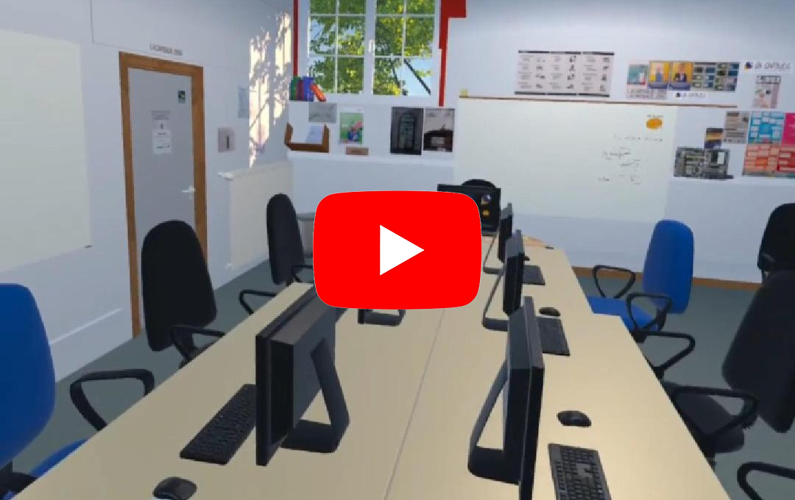

# La Capsule VR
An escape game in the former premises of a computer refurbishment association. The game is designed to be played asymmetrically: one player evolves in virtual reality and 2 to 3 other players play in reality. The clues are distributed in the virtual and real-life premises.

### WallBlockerRotationFixed.cs
High-precision wall collision handler for hand-grabbed objects in VR (Unity XR / Meta Quest).

This script prevents penetrations and jitter when interacting with physical surfaces
(e.g. walls, tables) during grab animations or rapid hand movements.  
It uses adaptive multi-step BoxCasts, contact pinning, and automatic depenetration to ensure
smooth object rotation and realistic surface behavior.

**Features**
- Dynamic surface detection with per-frame subdivision.
- Auto-pinning of objects to contacted surfaces.
- Configurable "Cast Proxy Box" for accurate hit detection.
- Optional depenetration on grab start.
- Layer-based filtering (e.g., ignore hands, colliders marked as `IgnoreWallBlockerAndImpact`).
- Integrated hook for impact audio feedback.

## 🎥 Demo

